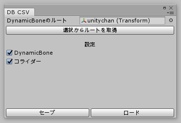
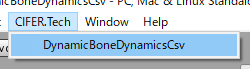

# DynamicBoneDynamicsCsv
DynamicBoneの設定をCSVにして保存／読込するエディタ拡張  

  

## 概要
DynamicBoneは扱いやすい揺れ物スクリプトです。  
ですが、UnitychanSpringBoneにあるような設定をCSVで保存しておく、読み込んで再度セットアップする、というような便利機能はありません。  
そこでDynamicBoneの設定をCSVに保存する、読み込んで再セットアップする、エディタ拡張を作りました。  

## 使い方
1. [Booth](https://cifertech.booth.pm/items/1962923)からUnityPackageをダウンロードしてインポートする。
2. プロジェクトのScripting Runtime Versionを __.NET4.x（もしくはそれ以上）__ にする。
3. メニューバーより __CIFER.Tech -> DynamicBoneDynamicsCsv__ を選択する。
4. 設定を保存／読込したいオブジェクトを登録する。
5. 一番下に出現する『セーブ』ボタン／『ロード』ボタンを押下する。

## 動作環境
- Unity2018.4.20f1
  - Scripting Runtime Version Experimental(.NET 4.6 Equivaient)
- [DynamicBone](https://assetstore.unity.com/packages/tools/animation/dynamic-bone-16743)

## FAQ
### コライダーも保存／読込できますか？
できます。ウィンドウ中の設定チェックボックスから、コライダーにチェックを入れてください。  
そうすることでコライダーの設定を保存／読込するようになります。

### 設定を保存したときと読み込んだときでモデルの構造が変わっているのですが大丈夫ですか？
大丈夫です。ただし、セーブ時と同じオブジェクト名が見つからない場合は、設定を復元せずにスキップします。

## ライセンス
本リポジトリは[MITライセンス](LICENSE)の下で公開しています。
